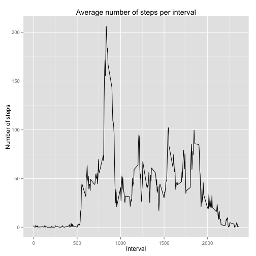
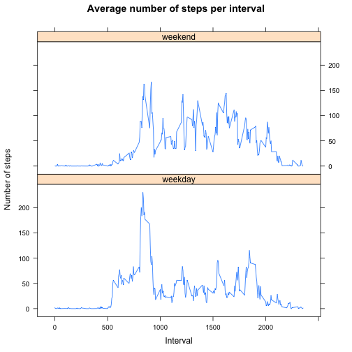

## Loading and preprocessing the data
The following segment of code retrieves the .csv data. 
Column names are added and the Date and Interval column are checked for character and numeric formats respectively. The lubridate library is used to format the Date column as POSICXct but this step could be avoided.


```r
library(lubridate)
library(dplyr)
library(ggplot2)
library(lattice)
## Read the .csv file into a dataframe.
activityRaw <- read.csv("activity.csv", stringsAsFactors = FALSE, header = FALSE, skip = 1)

# Add column names to the dataframe.
names(activityRaw) <- c("Steps", "Date", "Interval")

## Format the date column to a date format using lubridate.
if(!is.character(activityRaw$Date))
{
  activityRaw$Date <- as.character(activityRaw$Date)
}
activityRaw$Date <- ymd(activityRaw$Date)

## Format the interval column as numeric.
if(!is.numeric(activityRaw$Interval))
{
  activityRaw$Interval <- as.numeric(activityRaw$Interval)
}
```

## What is mean total number of steps taken per day
The following segment of code uses the dplyr library to create a table dataframe of the activity raw data.
This dataframe is then grouped by date and the steps per day are calculated. Not assigned values (i.e. NA) are ignored for the sum of steps per date. A histogram for the total number of steps taken each day is plotted using qplot, the mean and median for the total number of steps taken each day is also reported.


```r
## Group the table dataframe by date.
activityRawDataFrame <- tbl_df(activityRaw)
activityRawGrouped <- group_by(activityRawDataFrame, Date)

## Get the total number of steps for each day. Histogram of the total number of steps taken each day.
totalStepsPerDay <- summarise(activityRawGrouped, stepsPerDay = sum(Steps, na.rm = TRUE))
hist(totalStepsPerDay$stepsPerDay,  main = "Histogram of the total number of steps per day",
     xlab = "Steps per day", ylab = "Count")
```

 

```r
## Calculate the mean and median for the total number of steps taken per day.
meanTotalStepsPerDay <- mean(totalStepsPerDay$stepsPerDay)
medianTotalStepsPerDay <- median(totalStepsPerDay$stepsPerDay)
```

Ignoring the missing values (i.e. Steps = NA) the mean for the total number of steps taken per day is 9354.2295 and the median is 10395.

## What is the average daily activity pattern?
The followinf segment of code groups the dataframe by interval and calculates the mean value of steps for each interval. The dataframe still has missing values (i.e. Steps = NA) but these are ignored during the mean value calculation. A time series plot is used to show the required information.


```r
## Time series plot of the average number of steps per interval. The interval with the maximum average number of 
## steps is also identified.
activityRawGrouped <- group_by(activityRawDataFrame, Interval)
meanStepsPerInterval <- summarise(activityRawGrouped, meanSteps = mean(Steps, na.rm = TRUE))
q <- qplot(Interval, meanSteps, data = meanStepsPerInterval, geom = "line", 
           main = "Average number of steps per interval",
           xlab = "Interval", ylab = "Number of steps")
print(q)
```

 

```r
fslines <- which(meanStepsPerInterval$meanSteps == max(meanStepsPerInterval$meanSteps))
maxNumberInterval <- meanStepsPerInterval$Interval[fslines]
```

The interval with the maximum average of steps is interval 835 with an average of 206.1698 steps.

## Imputing missing values
The following segment of code counts the number of missing values in the dataframe. After grouping the dataframe by interval it replaces the missing values with the mean value of steps for each interval. The strategy used to replace the missing values is based on the mean value of steps for each interval.
A histogram for the total number of steps taken each day is plotted using qplot, the mean and median for the total number of steps taken each day is also reported.


```r
## Calculate the number of NAs in the dataframe.
naTotal <- sum(is.na(activityRawDataFrame$Steps))

## Get the mean number of steps per interval. Use these values to update the 
## NA values on the original dataframe.
totalStepsPerInterval <- summarise(activityRawGrouped, stepsPerInterval = mean(Steps, na.rm = TRUE))
activityProcessed <- activityRaw

for (i in 1:nrow(activityProcessed))
{
  if (is.na(activityProcessed$Steps[i]))
  {
    fslines <- which(totalStepsPerInterval$Interval == activityProcessed$Interval[i])
    replaceValue <- totalStepsPerInterval$stepsPerInterval[fslines]
    activityProcessed$Steps[i] <- replaceValue
  }
}

## Get the total number of steps for each day. Histogram of the total number of steps taken each day.
## Calculate the mean and median for the total number of steps taken per day.
activityProcessedGroupedDate <- group_by(activityProcessed, Date)
totalStepsPerDayProcessed <- summarise(activityProcessedGroupedDate, stepsPerDay = sum(Steps))
hist(totalStepsPerDayProcessed$stepsPerDay,  main = "Histogram of the total number of steps per day",
     xlab = "Steps per day", ylab = "Count")
```

 

```r
meanTotalStepsPerDayProcessed <- mean(totalStepsPerDayProcessed$stepsPerDay)
medianTotalStepsPerDayProcessed <- median(totalStepsPerDayProcessed$stepsPerDay)
```

The total number of missing values for the original dataframe is 2304.
After replacing the missing values (i.e. Steps = NA) the mean for the total number of steps taken per day is 1.0766 &times; 10<sup>4</sup> and the median is 1.0766 &times; 10<sup>4</sup>.
Replacing the missing values causes an increase in both the mean value and the median value, the magnitude of the increase is larger for the mean value. A noticeable effect after replacing the missing values with the described strategy (i.e. Mean number of steps per interval) is that the mean and median end up having the same value. On the histogram it is clear that the frequency (count) for the 10000-15000 steps per day interval increases at the expense of the reduction in frequency on the 0-5000 and 5000-10000 intervals.

## Are there differences in activity patterns between weekdays and weekends?
This following segment of code determines if the date belongs to either a weekday or a weekend. This information is then used to create a factor variable that can be used to group the processed dataframe along with the interval information. A time series plot is used to show the average number of steps per interval for the weekday and weekend.


```r
## Determine if the date is a weekday or a weekend. Column bind this column to the activityProcessedGrouped
## dataframe.
activityProcessedGrouped <- group_by(activityProcessed, Interval)
weekDayColumn <- vector("character", length = nrow(activityProcessedGrouped))

for (i in 1:nrow(activityProcessedGrouped))
{
  testWeekday <- weekdays(activityProcessedGrouped$Date[i])
  if ((testWeekday == "Saturday") || (testWeekday == "Sunday"))
  {
    weekDayColumn[i] <- "weekend"
  }
  else
  {
    weekDayColumn[i] <- "weekday"
  }
}

weekDayColumn <- factor(weekDayColumn)
activityProcessedGrouped <- cbind(activityProcessedGrouped, weekDayColumn)
names(activityProcessedGrouped) <- c("Steps", "Date", "Interval", "Factor")
activityProcessedGroupedFactor <- group_by(activityProcessedGrouped, Interval, Factor)
meanStepsPerIntervalFactor <- summarise(activityProcessedGroupedFactor, meanSteps = mean(Steps))
s <- xyplot(meanSteps~Interval | Factor, data = meanStepsPerIntervalFactor, layout = c(1,2), type = "l", 
       main = "Average number of steps per interval", xlab = "Interval", ylab = "Number of steps")
print(s)
```

 

During the weekday the maximum average number of steps is bigger however, during the weekend there seems to be a larger number of steps across the intervals. During the weekday the average number of steps increase close the 500 interval up to the maximum value. This increase start latter during the weekend.

